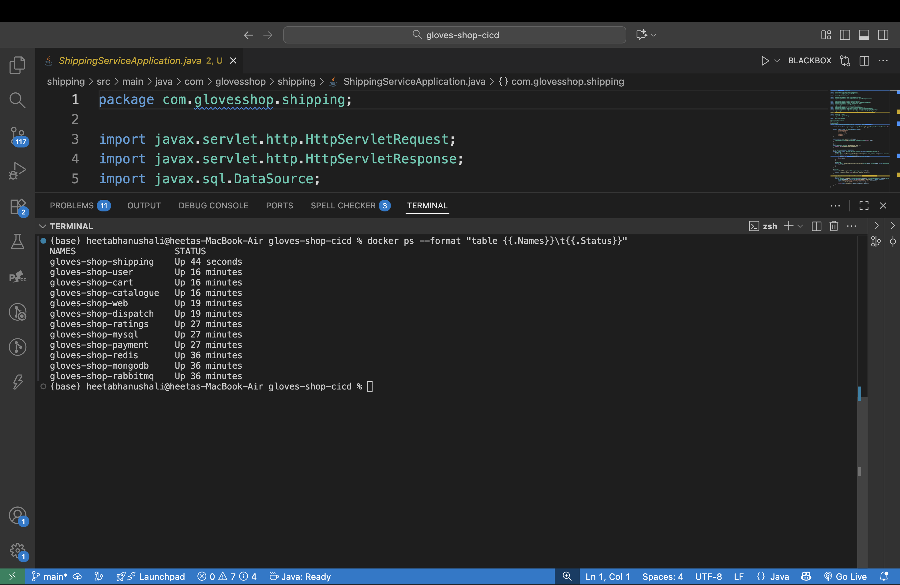
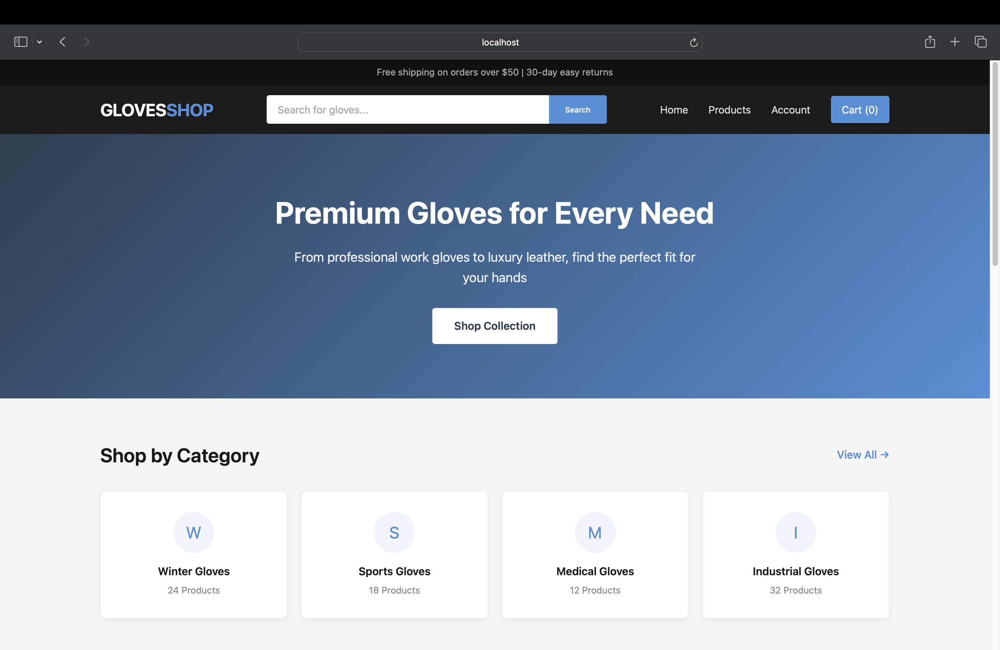
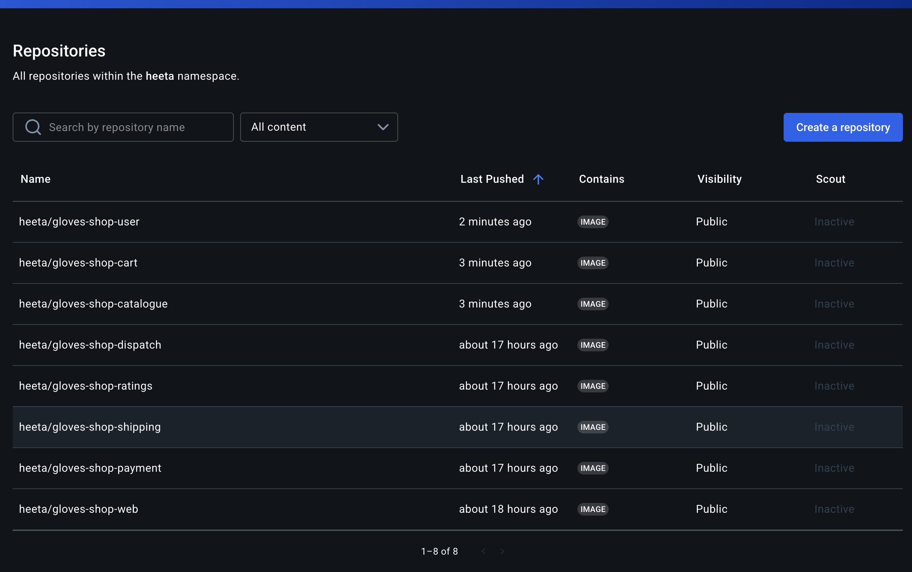
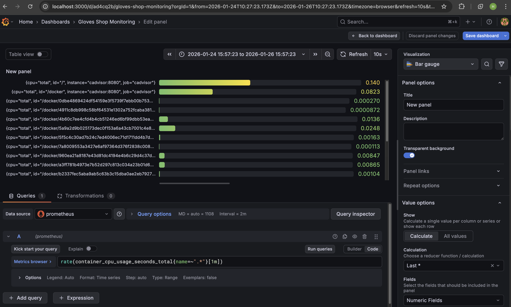

# Gloves Shop


A fully functional e-commerce microservices application demonstrating a complete **DevOps workflow**.

## Overview

Gloves Shop is a polyglot microservices application designed to showcase modern software development practices. It consists of 8 independent services, each built with a different language to simulate a diverse enterprise environment. The project highlights containerization with Docker, orchestration, and infrastructure as code.

### Key Features
*   **Microservices Architecture:** 8 services running independently.
*   **Polyglot Stack:** Node.js, Java, Python, Go, PHP.
*   **Data Persistence:** MongoDB, MySQL, Redis, RabbitMQ.
*   **DevOps Ready:** CI/CD pipelines, Terraform configurations, and Kubernetes manifests included.
*   **System Monitoring:** Implemented observability stack using Prometheus and Grafana for real-time tracking of CPU, memory, and network metrics across all 12 services.

---

## Architecture

```
graph TD
    User[User] -->|HTTP| Web[Nginx Web Server]
    Web -->|API| Catalogue[Catalogue Service<br/>Node.js + MongoDB]
    Web -->|API| Cart[Cart Service<br/>Node.js + Redis]
    subgraph "Monitoring Layer"
        Prometheus[Prometheus]
        Grafana[Grafana]
        cAdvisor[cAdvisor]
    end
    Web -->|Metrics| cAdvisor
    Cart -->|Metrics| cAdvisor
    Catalogue -->|Metrics| cAdvisor
    cAdvisor -->|Scrapes| Prometheus
    Prometheus -->|Data| Grafana
```

---

## Tech Stack

| Service | Language | Database | Purpose |
|---------|----------|----------|---------|
| **web** | Nginx | None | Frontend Gateway |
| **catalogue** | Node.js | MongoDB | Product Management |
| **cart** | Node.js | Redis | Session/Shopping Cart |
| **user** | Node.js | MongoDB | Authentication |
| **payment** | Python | RabbitMQ | Payment Processing |
| **shipping** | Java | MySQL | Logistics Calculation |
| **ratings** | PHP | MySQL | Product Reviews |
| **dispatch** | Go | RabbitMQ | Order Dispatch |

---

## Project Structure

```
gloves-shop-cicd/
├── .github/
│   └── workflows/
│       └── ci-cd.yml           # GitHub Actions Pipeline
├── K8s/                         # Kubernetes Manifests
├── src/                         # Source Code
│   ├── cart/
│   ├── catalogue/
│   ├── dispatch/
│   ├── payment/
│   ├── ratings/
│   ├── shipping/
│   ├── user/
│   └── web/
├── terraform/                   # AWS Infrastructure as Code
├── docker-compose.yaml          # Local Orchestration
├── Jenkinsfile                  # Jenkins Pipeline
└── README.md
```

---

## Getting Started

### Prerequisites
*   Docker
*   Docker Compose
*   Git

### Installation

1.  **Clone the repository**
    ```bash
    git clone https://github.com/your-username/gloves-shop-cicd.git
    cd gloves-shop-cicd
    ```

2. **Configure Environment Variables**
   ```bash
    # Copy example env file
    cp .env.example .env

    # Edit .env and set secure passwords
    nano .env
    ``` 

3.  **Build the images**
    ```bash
    docker-compose build
    ```

4.  **Run the application**
    ```bash
    docker-compose up -d
    ```

5.  **Access the application**
    *   Frontend: `http://localhost:8080`
    *   Grafana: `http://localhost:3000` (admin / your_password)
    *   Prometheus: `http://localhost:9090`
    *   RabbitMQ: `http://localhost:15672` (your_user / your_password)

### Verification
To ensure all services are running correctly:
```bash
docker ps
```
You should see 12 containers running (8 services + 4 databases/infrastructure).

---

## DevOps & CI/CD

This project is configured with a full CI/CD pipeline.

*   **GitHub Actions:** Automated builds, tests, and security scanning on push.
*   **Jenkins:** Alternative pipeline configuration included (`Jenkinsfile`).
*   **DockerHub:** Images are pushed to `heeta/gloves-shop-*`.
*   **Terraform:** Ready to deploy AWS EKS infrastructure (located in `/terraform`).

---

## Project Screenshots

### 1. Running Containers
All 12 services running successfully in Docker.


### 2. Application Interface
The Gloves Shop frontend serving requests.


### 3. Artifact Registry
Custom images published to DockerHub.


### System Monitoring
Real-time metrics for CPU, memory, and network traffic using Prometheus and Grafana.


---

## Future Improvements

*   [ ] Kubernetes Deployment on AWS EKS
*   [ ] Adding comprehensive integration tests
*   [ ] Implementing Service Mesh (Istio)

---

## Author

**Heeta Bhanushali**
*   [GitHub](https://github.com/heetabhanushali)
*   [DockerHub](https://hub.docker.com/u/heeta)

---
